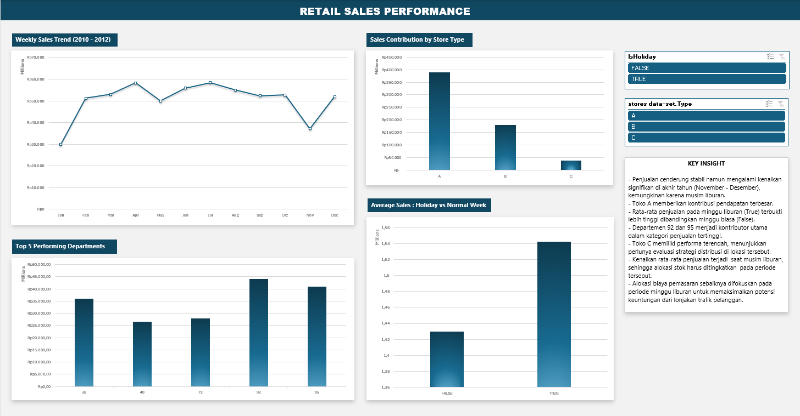

# Retail Sales Performance Dashboard

## Project Overview
Analisis performa penjualan ritel menggunakan Excel untuk melihat tren penjualan, dampak hari libur (holiday), serta kontribusi departemen dan tipe toko terhadap total pendapatan.

## Preview

## Key Insights (Berdasarkan Dashboard)
1. **Store Type Performance:** Toko **Tipe A** memiliki total penjualan tertinggi, diikuti oleh Tipe B, sedangkan Tipe C memiliki kontribusi terkecil.
2. **Holiday Impact:** Rata-rata penjualan pada minggu **Holiday (TRUE)** terlihat lebih tinggi secara signifikan dibandingkan minggu biasa (FALSE). Ini menunjukkan musim liburan sangat memengaruhi daya beli.
3. **Top Departments:** Terdapat 5 departemen utama (termasuk Dept 92 dan 95) yang menjadi penggerak utama total sales.
4. **Sales Trend:** Penjualan cenderung stabil dengan lonjakan yang terlihat jelas pada periode tertentu yang berkorelasi dengan hari libur.

## Tools Used
* **Microsoft Excel:** Pivot Tables, Slicers, dan Dashboard Design.
